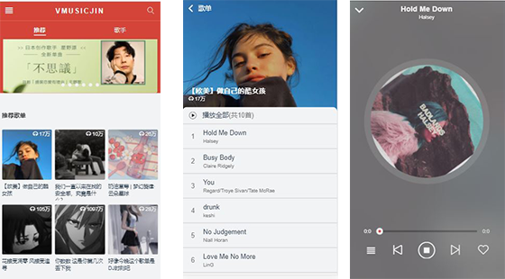
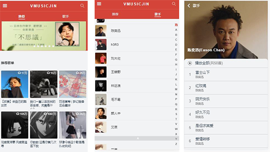
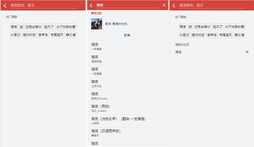

### 仿网易云音乐

基于Vue + Vuex + Vue-router + Axios + better-scroll等一款移动端网易云页面
#### 实现功能
+ 推荐页面
  推荐页分成三个部分，分别是 banner 轮播图、推荐歌单、推荐歌曲，数据都是使用 `axios` 请求 API 获取得到的，图片都使用 `vue-lazyload` 实现懒加载，better-scroll实现页面上下滚动。

+ 歌曲列表页面
点击推荐页面的每张图片，跳转到歌曲列表页面

+ 歌手列表页面
点击歌手，可以看到所有歌手，点击单个歌手，可以获取歌手详情页

+ 搜索页面

+ 总结
还未实现歌曲的播放功能，和歌曲的收藏功能，页面之间的跳转不流畅。学习开发该项目，是为了学习Vue框架，API的调用以及相关插件的使用等，同时熟悉CSS+JS的相关用法。
